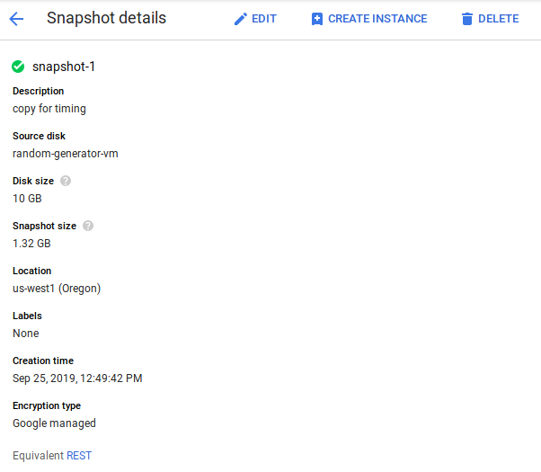

# IP Timing

Test timing for GCP deploy regions. This project requires pyyaml, which we include in our Pipfile.

Run `pipenv install` to install the virtual environment. Run `pipenv shell` to enter it.

Run the code with `python timing.py [filename]` where `[filename]` is a .yaml file of the format:

```
---
  ips:
    - IP_ONE
    - IP_TWO
    - IP_N
```

For an arbitrary number N of IPs.

# How to move your deployment to a new Region

## Any VM (Python or Java)

VMs make it easy to redeploy to a new region through snapshots.

Go to your VM instances. On the sidebar, look for the "Snapshots" menu item.


On the top bar, click the 'Create Snapshot' button.


Name the snapshot anything you'd like, and select a region in which to save it. This does NOT have to be the region you want to redeploy to - this is all just storing some data somewhere.

The most important thing is to select the VM you want to redeploy in the "Source disk" combo box.


Wait for GCP to take a snapshot of the disk. Once it does, it will appear on the Snapshots page. Once it does, click its name.

On the details page, click "Create Instance." This will create an instance from the snapshot. Deploy as you would a normal instance, being sure to select the correct region where prompted.



Finally, start your server back up as you normally would if you stop/start your instance. How this is done will depend on your own configuration. For example, on our python deployment we run `sudo /opt/bitnami/ctlscript.sh restart apache`. You can choose to configure your system such that these commands are run on boot, making the transition seamless. 

##  Any App Engine (Python or Java)

Unfortunately, you cannot change an App Engine project's region after setting it. We will need to create another project in App Engine. *Make sure you have Django, Python 2 & 3, and Pip installed.*

1. Create a new project in Google App Engine.
2. Go to the Cloud Shell.
3. Set your project ID in the session to your new project's ID using ```gcloud config set project [PROJECT_ID]```.
4. Then configure your project's region to whatever you like using ```gcloud config set compute/region [YOUR-REGION]```. In our case, we will use ```us-west1```.
5. Update using ```gcloud config list compute/region```.
6. Select your region using ```region=[YOUR-REGION]```.
7. Repeat steps 4-6 but with ```compute/zone```. In our case, we will set our zone to ```us-west1-a```.
8. Clone our App Engine repository into your project using ```https://github.com/jalberse/ip-timing.git```.
9. Create your application using ```gcloud app create```.
20. Run ```gcloud app deploy``` to deploy your application.

## Results

us-west1_a_VM_Python@http://35.197.97.54/Project 0.10211300849914551 295322

us-west1_a_app_Python@http://ip-timing.appspot.com/ 0.08312058448791504 930672

us-east1_b_VM_Java@http://35.196.181.146:8080/randnum/hello 0.0851597785949707 513040

us-east1_b_VM_Python@http://35.237.232.176 0.08409714698791504 697510

us-east1_b_VM_Java@http://35.196.181.146:8080/randnum/hello 0.08246612548828125 55751

asia-northeast1_a_app_Python@http://regions-254017.appspot.com/ 0.2749977111816406 881557

asia-northeast1_a_VM_Python@http://34.84.95.192 0.4169001579284668 333403

asia-south1_c_AppEngine_Python@https://timing-experiment-cs4263.appspot.com/ 1.8119325637817383 443394

Error @ asia-northeast1_a_app_Java@https://glass-pen-254017.appspot.com

asia-south-1_a_VM_Java@http://34.93.76.51:8080/rng/ 0.8535482883453369 831377

Error @ asia-northeast1_b_VM_Java@http://34.85.71.249:8080/random/hello.jsp

australiasoutheast1_b_vm_java@http://35.189.39.14/randnum/randnum 0.3838684558868408 243630

australiasoutheast1_b_vm_python@http://35.189.43.96:5000 0.3991258144378662 889393

australiasoutheast1_b_app_java@http://galvanic-ward-254017.appspot.com 1.3744373321533203 304894

australiasoutheast1_b_app_python@http://python-aus.appspot.com/ 0.41823911666870117 552050

Error @ asia-south1_c_app_java@http://team-23-asia-southeast.appspot.com/

Error @ asia-northeast2_a_VM_Java@http://34.97.51.216:8080/number.jsp

Timeout error @ europe-north1_b_VM_Python@http://35.228.60.206:5000/

asia-northeast2_a_app_Python@http://rng-python-asiane2.appspot.com 0.7647767066955566 178117

asia_east2_c_VM_Python@http://35.220.136.215/ 0.4155292510986328 571468

asia-southeast1_a_VM_Python@http://34.87.17.67/python/ 0.4731781482696533 970994

asia-southeast1_a_VM_Java@http://34.87.17.67/java/RandGen.shtml 0.5264365673065186 889198

asia-south1_c_AppEngine_Java@http://region-change.appspot.com/demo 0.3163783550262451 171813

southeast-australia-1_c_AppEngine_Python@https://cs-4263-1.appspot.com/ 1.4012744426727295 837944

asia-northeast_2a_VM_Python@http://34.97.25.195 0.624722957611084 336762

asia_east2_app_Python@https://cs4263-rngtiming.appspot.com/ 1.2563068866729736 240641

Error @ asia_east2_app_Java@https://javaproject1-254017.appspot.com/

asia_east2_VM_Python@http://35.220.136.215/ 0.6509764194488525 372580

europe-west3_b_app_python@http://radom-timing-experiment.appspot.com 0.20753169059753418 279949

europe-west3_b_app_java@http://java-dot-radom-timing-experiment.appspot.com 0.20923328399658203 233317

europe-west3_b_vm_Java@http://35.246.243.145 0.30572938919067383 923771

europe-west3_b_vm_Python@http://35.234.125.152 0.42618346214294434 794974

Timeout error @ europe-west6_a_VM_Java_@http://34.65.30.164

southamerica-east1_a_VM_Python@http://34.95.171.137/ 0.41869688034057617 915922

europe-west4_a_VM_Python@http://35.204.2.146/ 0.41762304306030273 432746

Error @ asia-south1_a_VM_Python@http://34.93.13.81:8000/

europe-west3_a_app_Python@https://python-ae-test.appspot.com/ 0.942279577255249 353515

europe-west3_a_VM_Python@http://35.242.194.148/ 0.31115055084228516 84517

Error @ europe-west3_a_app_Java@https://glassy-droplet-254017.appspot.com

europe-west3_a_VM_Java@http://35.198.133.185/Servlets/RandomNumberGen 0.3322732448577881 607454

europe-west2_a_VM_Java@http://35.242.148.119/javarng 0.39396214485168457 151150

europe-west2_a_VM_Python@http://35.242.148.119/pythonrng 0.3243062496185303 151328

europe-west2_a_app_Java@https://javarng-dot-universal-helix-254016.appspot.com/ 0.92958664894104 863543

europe-west2_a_app_Python@https://pythonrng-dot-universal-helix-254016.appspot.com/ 0.41705846786499023 989777

us-centra1_a_app_Python@https://agile-genius-254017.appspot.com 0.11775612831115723 675867

us-central1_a_app_Java@http://random-num-generator-java.appspot.com/ 0.06962895393371582 19501

us-central1_a_VM_Python@http://34.67.208.90:5000 0.0546724796295166 931094

us-central1_a_VM_Java@http://35.232.76.156:8080/randomnum/rnd.jsp 0.05420088768005371 707049

Error @ us-east4_a_VM_Java_@http://35.245.249.223:8080/javaapp-1.0-SNAPSHOT/

Error @ us-east4_app_Java_@https://java-east.appspot.com/

Error @ us-east4_a_VM_Python_@http://35.236.251.120:5000/

Error @ us-east4_app_Python_@https://distributed-inn-254017.appspot.com/

Error @ europe-west2_zoneb_VM_Python@http://34.89.105.129/

us-central_c_app_Java@http://software-engineering-4263.appspot.com/randomnumber 0.07129764556884766 499691

europe-west3_c_app_Python@https://xenon-blade-254017.appspot.com/ 0.8462581634521484 201513

us-central_a_VM_Python@https://centralus.mag-i-c.com/ 0.16106843948364258 518369

us-central_a_VM_Java@http://javavm.mag-i-c.com/ 0.09302973747253418 118903

us-central_*_app_Java@https://software-engineering-250801.appspot.com/ 0.11402153968811035 850346

us-central_*_app_Java@https://capstoneproject-251917.appspot.com/ 0.11152982711791992 672322

asia-east1_b_VM_Python@https://eastasia.mag-i-c.com/ 0.8961670398712158 367763

asia-east1_b_VM_Java@http://eastasiajava.mag-i-c.com/ 0.4166710376739502 374271

asia-east2_*_app_Python@https://adept-storm-254017.appspot.com/ 1.2552831172943115 977506

asia-east2_*_app_Java@https://timing-experiment-2.appspot.com/ 0.4150691032409668 103717

Error @ europe-west6_a_VM_Java@http://34.65.233.205:8080/Rng/giveme

Error @ europe-west6_a_VM_Java@http://34.65.233.205:8080/Rng/giveme

Error @ europe-west6_a_app_Java@https://20190925t131126-dot-green-network-254018.appspot.com/rnd

Error @ asia-south1_a_app_Java@https://javaappexperiment.appspot.com

Error @ asia-south-1_a_app_Python@https://graphite-hook-254021.appspot.com/

us-west2_us-west2-a_VM_Python@http://35.236.38.77/vm/python.py 0.13453054428100586 976666

us-west2_us-west2-a_VM_Java@http://35.236.38.77/vm/java.sh 0.40489816665649414 191264

us-west2_us-west2-a_app_Python@https://pyapp-254017.appspot.com/ 0.4216430187225342 376441

us-west2_us-west2-a_app_Java@https://javaapp-3298719.appspot.com/ 0.17607951164245605 555504

europe-west6_a_VM_Python@http://34.65.60.226 0.6556870937347412 884955

Error @ europe-north1_a_app_Java@https://timing-experiment-254017.appspot.com/

Error @ europe-west6_a_app_Python@http://vivid-memento-254504.appspot.com

europe-west1_b_app_python@http://timing-experiment.appspot.com/ 0.2709224224090576 398562

europe-west1_b_app_java@http://random-timing.appspot.com 0.6245925426483154 910191

europe-west1_b_vm_Java@http://35.195.133.24:8000 0.7313055992126465 960888

europe-west1_b_vm_Python@http://35.195.133.24:8080 0.5218427181243896 980685

Error @ asia-south1_b_app_Python@https://melodic-lantern252322.appspot.com/

Error @ asia-south1_b_VM_Python@https://python-compute252322.appspot.com/

asia-south1_b_app_Java@https://random-number-generator-251217.appspot.com/ 0.11956501007080078 189779

asia-south1_b_VM_Java@http://35.239.94.178:8080/ 0.05464529991149902 418075

europe-north1_b_VM_Java@http://35.228.170.187/ 0.4627726078033447 920637

europe-west2_c_app_Python@http://voltaic-azimuth-254421.appspot.com/ 0.8346405029296875 496293

northamerica-northeast1_a_app_Python@https://a-project-made-of-time.appspot.com/ 0.4190201759338379 99606

europe-west6_a_app_Python@https://project1-2-254017.appspot.com/ 1.0461294651031494 464812

us-east1_b_app_Python@https://pythonae-east.appspot.com/ 0.41495585441589355 933416

us-east1-b-app-Java@http://airy-web-254017.appspot.com/demo 0.13488221168518066 29152

Error @ europe-west2_b_app_python@https://python-app-new-server.appspot.com/

Error @ europe-west2_b_app_java@http://35.246.72.72:8080/javarand/MyServlet

US-Central-1_a_VM_Java@http://35.225.166.187:8080/rng/ 0.0561375617980957 382211

US-Central-1_a_VM_Python@http://35.225.166.187/ 0.061235904693603516 638304